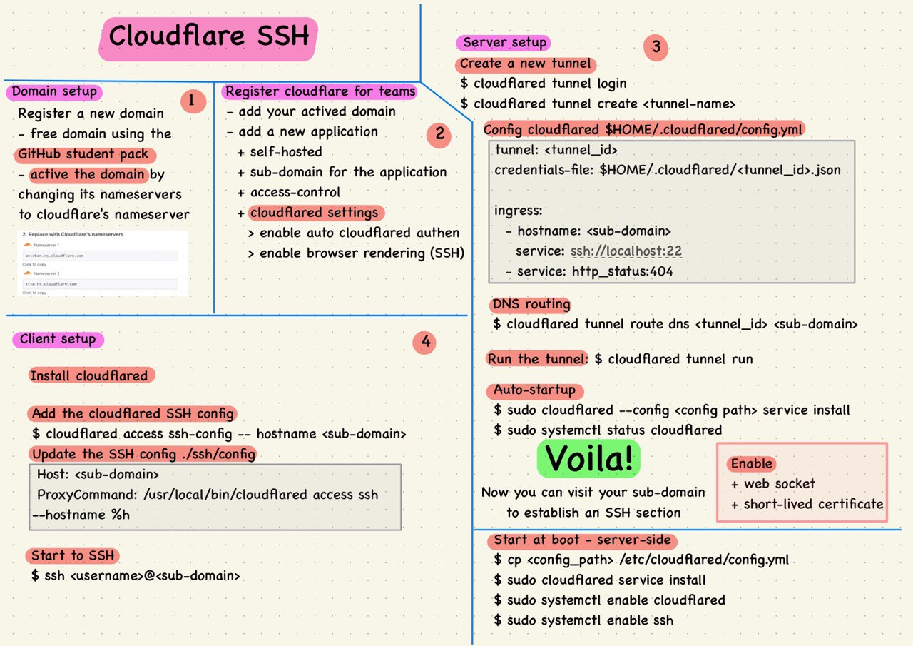

# Giới thiệu
- Bằng cách sử dụng cloudflare tunnel, mình có thể tự cài đặt được một giao diện SSH thông qua trình duyệt mà không cần bất kỳ ứng dụng thêm nào bên phía client.

# Chuẩn bị
- Domain của riêng bạn (Có thể lấy các domain free trong gói student package nếu đang là sinh viên)
- Tài khoản cloudflare 
- Một thiết bị có thể cài đặt [cloudflared](https://github.com/cloudflare/cloudflared)

# Các bước tiến hành
1. Kích hoạt domain của bạn trên cloudflare (Đổi các nameservers của domain về thành nameservers của cloudflare)
1. Vào mục cloudflare for teams, thêm một application mới (bật tùy chọn enable browser rendering > SSH)
1. Ở phía server 
   1. Tạo tunnel
   1. Cấu hình tunnel trỏ đến sub-domain (hoặc domain của bạn)
   1. Tạo DNS record cho sub-domain
1. Truy cập vào sub-domain/domain đã cấu hình, xác thực, nhập user & pass

# SSH
- Ngoài ra, còn có thể SSH từ máy client sang server thông qua sub-domain/domain sử dụng SSH thông thường